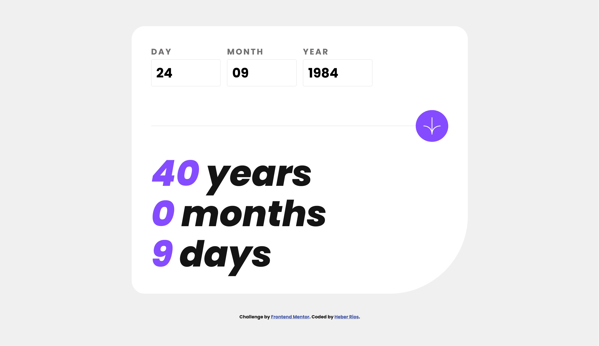
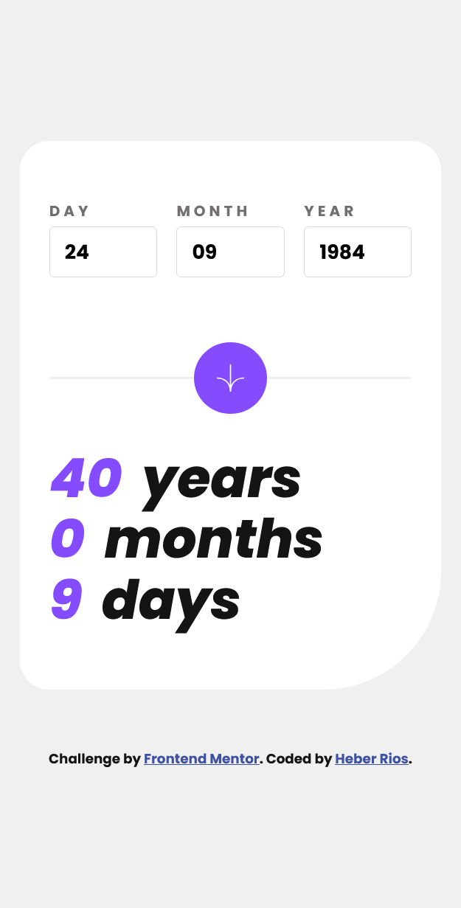

# Frontend Mentor - Age calculator app solution

This is a solution to the [Age calculator app challenge on Frontend Mentor](https://www.frontendmentor.io/challenges/age-calculator-app-dF9DFFpj-Q).

## Table of contents

-   [Frontend Mentor - Age calculator app solution](#frontend-mentor---age-calculator-app-solution)
    -   [Table of contents](#table-of-contents)
    -   [Overview](#overview)
        -   [The challenge](#the-challenge)
        -   [Screenshot](#screenshot)
        -   [Links](#links)
    -   [My process](#my-process)
        -   [Built with](#built-with)
        -   [What I learned](#what-i-learned)
        -   [Continued development](#continued-development)
        -   [Useful resources](#useful-resources)
    -   [Author](#author)
    -   [Acknowledgments](#acknowledgments)

## Overview

### The challenge

Users should be able to:

-   View an age in years, months, and days after submitting a valid date through the form
-   Receive validation errors if:
    -   Any field is empty when the form is submitted
    -   The day number is not between 1-31
    -   The month number is not between 1-12
    -   The year is in the future
    -   The date is invalid e.g. 31/04/1991 (there are 30 days in April)
-   View the optimal layout for the interface depending on their device's screen size
-   See hover and focus states for all interactive elements on the page
-   **Bonus**: See the age numbers animate to their final number when the form is submitted

### Screenshot

-   Desktop design 
-   Mobile design 

### Links

-   [Solution URL]()
-   [Live Site URL]()

## My process

### Built with

-   Semantic HTML5 markup
-   CSS custom properties
-   CSS Flexbox
-   CSS GRID
-   Mobile-first workflow
-   JavaScript

### What I learned

Basic use of Date objects in JavaScript.

### Continued development

Have a better understanding of semantic HTML and fluid typography.

Have better website layout building sense.

### Useful resources

-   [Why use rem instead of px](https://www.youtube.com/watch?v=xCSw6bPXZks) - This taught me
    a new best practice for responsive design.

-   [Use of clamp](https://www.youtube.com/watch?v=erqRw3E-vn4&t=202s) - This is an amazing article which helped me understand CSS clamp better. I'd recommend it to anyone still learning this concept.

-   [Dates objects](https://developer.mozilla.org/en-US/docs/Web/JavaScript/Reference/Global_Objects/Date)

## Author

-   Frontend Mentor - [@HeberRios](https://www.frontendmentor.io/profile/HeberRios)

## Acknowledgments

-   Frontend Mentor - [@JEWebDev](https://www.frontendmentor.io/profile/JEWebDev)
